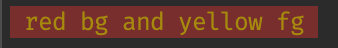
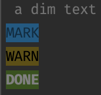

# Crayon

```js
import crayon from '@me5on/crayon';


console.log(crayon('{: bg.red + fg.yellow :: red bg and yellow fg :}'));
```



```js
const {ansi: A, create} = crayon;

const custom = create({
  syntax: {
    and: ',', esc: '', dot: '',
    bgn: '\\{', mid: ':', end: '\\}',
  },
  box:    {
    dim:  A.cc.dim,
    done: A.bg.green + A.fg.white + A.cc.bright,
    warn: A.bg.yellow + A.fg.black,
    info: A.bg.blue + A.fg.black,
  },
});

console.log(custom('{dim: a dim text }'));
console.log(custom('{dim,info:MARK}'));
console.log(custom('{warn:WARN}'));
console.log(custom('{done:DONE}'));
```



Can also use it as a tag for template strings

```js
console.log(custom`{dim: a dim text }`);
console.log(custom`{dim,info:MARK}`);
console.log(custom`{warn:WARN}`);
console.log(custom`{done:DONE}`);
```
